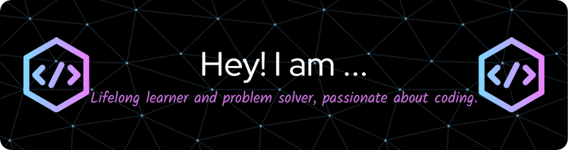

  

<h2 align="left">Hi 👋, I'm Prashant Katheriya!</h2>

- 🔭 **Currently Working On:**  
  A Chat Application with VS Code integration and Docker-based execution.

- 👥 **Looking to Collaborate On:**  
  Web development and AI/ML projects.

- 🤝 **Seeking Help With:**  
  Exploring AI integration in web apps.

- 🌱 **Currently Learning:**  
  Docker and advanced web development with AI.

- 💬 **Ask Me About:**  
  C++, DSA, Web Development, and ML.

- ⚡ **Fun Fact:**  
  I’m a fitness enthusiast exploring AI-driven tech! 🚀

---

---

---

## 💻 **Tech Stack:**

  
  
  
  
  
  
  
  
  
  
  
  
  
  
  

---

## 🌐 **Connect with Me:**

  
  
  
  

---
## 🚀 Latest Projects

## 🚀 My Projects

### 📌 [Stream line Interview: End-to-End Video Interview Application]

- 💻 [GitHub Repository](https://github.com/legendcyber28/Remote-interview-platform)
- 🌐 [Live Site](https://steady-wasp-81.accounts.dev/sign-in?redirect_url=https%3A%2F%2Fremote-interview-platform-pi.vercel.app%2F)
- 🧠 Description: A full-stack video interview platform for seamless candidate-recruiter interactions. It features real-time video calls, session scheduling, and user authentication.
Tech Stack: Next.js, Convex (Database), Stream (Video Calling), Tailwind CSS.

## 📊 **GitHub Stats:**

  
  

---

## 🏆 **GitHub Trophies:**

  

---

## 🐍 **GitHub Contribution Snake:**

<picture>
  <source media="(prefers-color-scheme: dark)" srcset="https://raw.githubusercontent.com/legendcyber28/legendcyber28/output/github-snake-dark.svg" />
  <source media="(prefers-color-scheme: light)" srcset="https://raw.githubusercontent.com/legendcyber28/legendcyber28/output/github-snake.svg" />
  
</picture>

---

## 📈 **Top Contributed Repos:**

---

## 💬 **Random Dev Quote:**

---

## 🔥 **Visitor Count:**

  

---

## 🎨 **Thanks for Visiting!**

  

---
